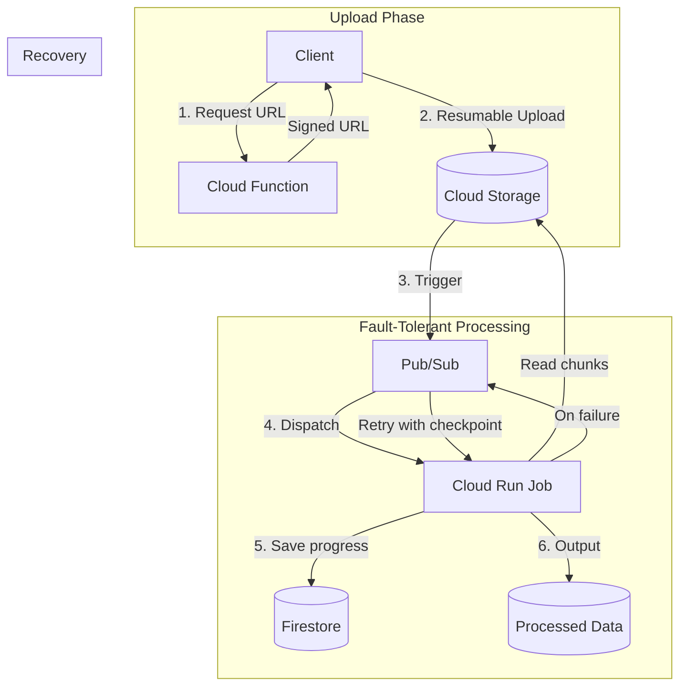
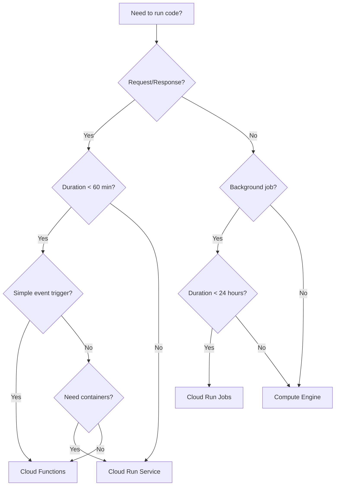
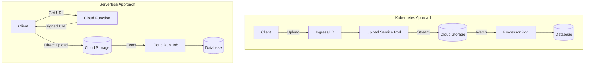
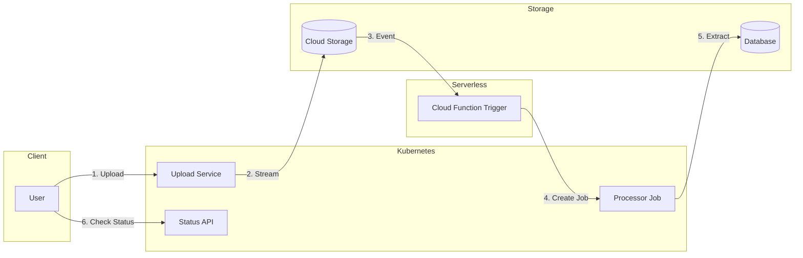
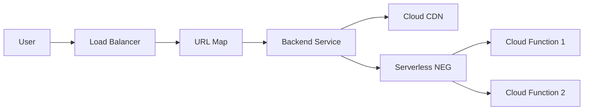
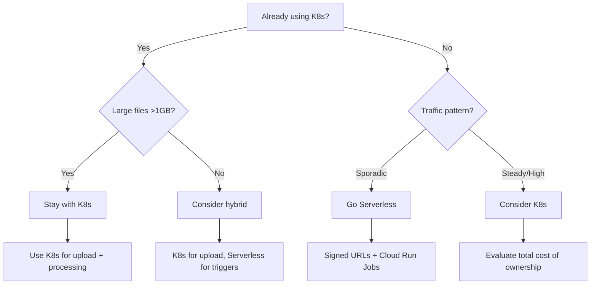

# Fault-Tolerant Large File Processing Architecture

---

## Google Cloud Functions: Complete Guide

### What is Cloud Functions?

Google Cloud Functions is a serverless, event-driven compute platform that allows you to run code in response to events without managing servers. It automatically scales based on demand and you only pay for the compute time you consume.

### Cloud Functions Generations

| Feature | 1st Gen | 2nd Gen (Recommended) ||---------|---------|----------------------|| Max Timeout | 9 minutes | 60 minutes || Max Memory | 8 GB | 32 GB || Max vCPUs | 2 | 8 || Concurrency | 1 request/instance | Up to 1000 requests/instance || Min Instances | Yes | Yes || Built on | Custom | Cloud Run |

### Use Cases

#### Ideal Use Cases for Cloud Functions

| Use Case | Description | Example ||----------|-------------|---------|| **API Endpoints** | Lightweight REST/GraphQL APIs | User authentication, data validation || **Event Processing** | React to cloud events | File uploaded to GCS, Firestore document changed || **Webhooks** | Handle third-party callbacks | Stripe payments, GitHub webhooks || **Scheduled Tasks** | Cron-like jobs | Daily reports, cleanup tasks || **Data Transformation** | ETL for small datasets | Format conversion, thumbnail generation || **IoT Processing** | Handle device messages | Pub/Sub message processing || **Chatbots/AI** | Quick inference calls | Dialogflow fulfillment, OpenAI API calls |

#### Not Ideal Use Cases

| Use Case | Why Not | Better Alternative ||----------|---------|-------------------|| Long-running jobs (>60 min) | Timeout limits | Cloud Run Jobs, Compute Engine || Large file processing (>32MB payload) | Request size limits | Direct GCS upload + event trigger || Persistent connections | Stateless nature | Cloud Run, GKE || High-memory workloads (>32GB) | Memory limits | Compute Engine || GPU/ML training | No GPU support | Vertex AI, Compute Engine |

### Advantages

1. **Zero Server Management** - No infrastructure to provision, patch, or maintain
2. **Auto-scaling** - Scales from 0 to thousands of instances automatically
3. **Pay-per-use** - Billed only for execution time (100ms granularity)
4. **Fast Deployment** - Deploy in seconds with `gcloud functions deploy`
5. **Built-in Security** - IAM integration, VPC connectors, secret management
6. **Native GCP Integration** - Triggers from GCS, Pub/Sub, Firestore, etc.
7. **Multiple Runtimes** - Node.js, Python, Go, Java, .NET, Ruby, PHP

### Disadvantages

1. **Cold Starts** - First invocation after idle period has latency (100ms-2s)
2. **Execution Limits** - Max 60 minutes timeout, 32GB memory
3. **Payload Limits** - 32MB for HTTP, 10MB for event-driven
4. **Stateless** - No persistent local storage between invocations
5. **Vendor Lock-in** - Tied to GCP ecosystem
6. **Debugging Complexity** - Harder to debug than local applications
7. **Cost at Scale** - Can be expensive for high-volume, long-running workloads

### Node.js Usage Examples

#### 1. HTTP Function (REST API)

```javascript
const functions = require('@google-cloud/functions-framework');

// HTTP triggered function
functions.http('helloWorld', (req, res) => {
  const name = req.query.name || req.body.name || 'World';
  res.json({ message: `Hello, ${name}!` });
});
```

**Deploy:**

```bash
gcloud functions deploy helloWorld \
  --gen2 \
  --runtime=nodejs20 \
  --trigger-http \
  --allow-unauthenticated \
  --region=us-central1
```

#### 2. Cloud Storage Trigger

```javascript
const functions = require('@google-cloud/functions-framework');
const { Storage } = require('@google-cloud/storage');

// Triggered when file is uploaded to GCS
functions.cloudEvent('processFile', async (cloudEvent) => {
  const file = cloudEvent.data;
  console.log(`File uploaded: ${file.name}`);
  console.log(`Bucket: ${file.bucket}`);
  console.log(`Size: ${file.size} bytes`);
  
  // Process the file
  const storage = new Storage();
  const [metadata] = await storage
    .bucket(file.bucket)
    .file(file.name)
    .getMetadata();
    
  console.log('Content-Type:', metadata.contentType);
});
```

**Deploy:**

```bash
gcloud functions deploy processFile \
  --gen2 \
  --runtime=nodejs20 \
  --trigger-event-filters="type=google.cloud.storage.object.v1.finalized" \
  --trigger-event-filters="bucket=my-bucket" \
  --region=us-central1
```

#### 3. Pub/Sub Trigger

```javascript
const functions = require('@google-cloud/functions-framework');

// Triggered by Pub/Sub message
functions.cloudEvent('processPubSub', (cloudEvent) => {
  const message = cloudEvent.data.message;
  const data = Buffer.from(message.data, 'base64').toString();
  const parsed = JSON.parse(data);
  
  console.log('Received message:', parsed);
  // Process message...
});
```

**Deploy:**

```bash
gcloud functions deploy processPubSub \
  --gen2 \
  --runtime=nodejs20 \
  --trigger-topic=my-topic \
  --region=us-central1
```

#### 4. Firestore Trigger

```javascript
const functions = require('@google-cloud/functions-framework');

// Triggered when Firestore document is created
functions.cloudEvent('onUserCreated', async (cloudEvent) => {
  const document = cloudEvent.data;
  const userId = cloudEvent.subject.split('/').pop();
  
  console.log(`New user created: ${userId}`);
  console.log('Document data:', document.value.fields);
  
  // Send welcome email, create related documents, etc.
});
```

#### 5. Scheduled Function (Cron)

```javascript
const functions = require('@google-cloud/functions-framework');
const { Firestore } = require('@google-cloud/firestore');

// Runs on a schedule (triggered by Cloud Scheduler via Pub/Sub)
functions.cloudEvent('dailyCleanup', async (cloudEvent) => {
  const db = new Firestore();
  const cutoff = new Date();
  cutoff.setDate(cutoff.getDate() - 30);
  
  // Delete documents older than 30 days
  const snapshot = await db
    .collection('temp_data')
    .where('createdAt', '<', cutoff)
    .limit(500)
    .get();
    
  const batch = db.batch();
  snapshot.docs.forEach(doc => batch.delete(doc.ref));
  await batch.commit();
  
  console.log(`Deleted ${snapshot.size} old documents`);
});
```

#### 6. Async Function with Background Processing

```javascript
const functions = require('@google-cloud/functions-framework');
const { PubSub } = require('@google-cloud/pubsub');

const pubsub = new PubSub();

// HTTP endpoint that queues work for background processing
functions.http('queueWork', async (req, res) => {
  const { taskType, data } = req.body;
  
  // Validate request
  if (!taskType || !data) {
    return res.status(400).json({ error: 'Missing taskType or data' });
  }
  
  // Queue for background processing
  const messageId = await pubsub.topic('background-tasks').publishMessage({
    data: Buffer.from(JSON.stringify({ taskType, data })),
    attributes: { taskType }
  });
  
  res.json({ 
    message: 'Task queued',
    messageId,
    status: 'processing'
  });
});
```

#### 7. Function with Secret Manager

```javascript
const functions = require('@google-cloud/functions-framework');
const { SecretManagerServiceClient } = require('@google-cloud/secret-manager');

const client = new SecretManagerServiceClient();

async function getSecret(secretName) {
  const [version] = await client.accessSecretVersion({
    name: `projects/my-project/secrets/${secretName}/versions/latest`
  });
  return version.payload.data.toString();
}

functions.http('secureEndpoint', async (req, res) => {
  const apiKey = await getSecret('external-api-key');
  
  // Use the secret
  const response = await fetch('https://api.example.com/data', {
    headers: { 'Authorization': `Bearer ${apiKey}` }
  });
  
  res.json(await response.json());
});
```

### package.json for Cloud Functions

```json
{
  "name": "cloud-functions",
  "version": "1.0.0",
  "main": "index.js",
  "engines": {
    "node": ">=20"
  },
  "scripts": {
    "start": "functions-framework --target=helloWorld",
    "test": "mocha tests/"
  },
  "dependencies": {
    "@google-cloud/functions-framework": "^3.3.0",
    "@google-cloud/storage": "^7.7.0",
    "@google-cloud/firestore": "^7.3.0",
    "@google-cloud/pubsub": "^4.3.0",
    "@google-cloud/secret-manager": "^5.0.0"
  }
}
```

### Best Practices for Cloud Functions with Node.js

1. **Reuse connections** - Initialize clients outside the handler
2. **Use async/await** - Avoid callback hell
3. **Handle errors gracefully** - Return proper HTTP status codes
4. **Set appropriate timeouts** - Don't use max timeout unnecessarily
5. **Use minimum memory** - Start small, increase if needed
6. **Enable min instances** - Reduce cold starts for critical functions
7. **Use structured logging** - For better Cloud Logging integration
```javascript
// Good: Reuse connections
const { Firestore } = require('@google-cloud/firestore');
const db = new Firestore(); // Initialized once, reused

exports.handler = async (req, res) => {
  // db is already initialized
  const doc = await db.collection('users').doc(req.params.id).get();
  res.json(doc.data());
};
```


---

## Large File Upload Architecture

## The Problem

Cloud Functions can be killed due to:

- **Timeout limits** (60 min max for 2nd gen)
- **Memory exhaustion** 
- **Cold start/scaling issues**
- **Transient infrastructure failures**

For >1GB files with data extraction, we need **resumable processing with checkpointing**.

## Recommended Architecture



## Key Design: Checkpointed Chunk Processing

### 1. Processing Job with Checkpointing (Cloud Run Job)

Cloud Run Jobs are better for this use case:

- **Up to 24-hour timeout**
- **Automatic retries**
- **No request/response overhead**
```javascript
const { Storage } = require('@google-cloud/storage');
const { Firestore } = require('@google-cloud/firestore');
const readline = require('readline');

const storage = new Storage();
const db = new Firestore();

async function processLargeFile(bucketName, fileName, jobId) {
  // Get checkpoint (last processed position)
  const checkpointRef = db.collection('processing_checkpoints').doc(jobId);
  const checkpoint = await checkpointRef.get();
  const startByte = checkpoint.exists ? checkpoint.data().lastByte : 0;
  
  const file = storage.bucket(bucketName).file(fileName);
  const [metadata] = await file.getMetadata();
  const totalSize = parseInt(metadata.size);
  
  // Stream from last checkpoint
  const readStream = file.createReadStream({
    start: startByte,
    end: totalSize
  });
  
  const rl = readline.createInterface({ input: readStream });
  
  let processedBytes = startByte;
  let batchData = [];
  const BATCH_SIZE = 1000; // Process 1000 lines, then checkpoint
  const CHECKPOINT_INTERVAL = 10 * 1024 * 1024; // Checkpoint every 10MB
  let lastCheckpointByte = startByte;
  
  for await (const line of rl) {
    // Process line (extract data)
    const extracted = extractData(line);
    batchData.push(extracted);
    processedBytes += Buffer.byteLength(line, 'utf8') + 1;
    
    // Batch write extracted data
    if (batchData.length >= BATCH_SIZE) {
      await saveBatch(batchData, jobId);
      batchData = [];
    }
    
    // Checkpoint progress periodically
    if (processedBytes - lastCheckpointByte >= CHECKPOINT_INTERVAL) {
      await checkpointRef.set({
        lastByte: processedBytes,
        progress: Math.round((processedBytes / totalSize) * 100),
        updatedAt: new Date()
      });
      lastCheckpointByte = processedBytes;
      console.log(`Checkpoint saved: ${Math.round((processedBytes / totalSize) * 100)}%`);
    }
  }
  
  // Final save
  if (batchData.length > 0) {
    await saveBatch(batchData, jobId);
  }
  
  // Mark complete
  await checkpointRef.set({
    lastByte: totalSize,
    progress: 100,
    status: 'completed',
    completedAt: new Date()
  });
}

function extractData(line) {
  // Your extraction logic (CSV parsing, JSON parsing, etc.)
  return JSON.parse(line); // Example
}

async function saveBatch(data, jobId) {
  // Save to Firestore, BigQuery, or another GCS file
  const batch = db.batch();
  data.forEach((item, i) => {
    const ref = db.collection(`extracted_data_${jobId}`).doc();
    batch.set(ref, item);
  });
  await batch.commit();
}
```


### 2. Pub/Sub Trigger with Dead Letter Queue

Ensures messages aren't lost if processing fails:

```javascript
// Cloud Function: Triggered by GCS upload
exports.onFileUploaded = async (event, context) => {
  const { PubSub } = require('@google-cloud/pubsub');
  const pubsub = new PubSub();
  
  const message = {
    bucket: event.bucket,
    file: event.name,
    jobId: `job_${Date.now()}_${event.name}`,
    attempt: 1
  };
  
  // Publish to processing queue
  await pubsub.topic('file-processing').publishMessage({
    data: Buffer.from(JSON.stringify(message)),
  });
};
```

### 3. Cloud Run Job Configuration

```yaml
# job.yaml
apiVersion: run.googleapis.com/v1
kind: Job
metadata:
  name: file-processor
spec:
  template:
    spec:
      containers:
        - image: gcr.io/PROJECT/file-processor
          resources:
            limits:
              memory: "4Gi"
              cpu: "2"
          env:
            - name: GCS_BUCKET
              value: "your-bucket"
      timeoutSeconds: 86400  # 24 hours max
      taskCount: 1
      maxRetries: 3  # Automatic retries on failure
```

### 4. Retry Handler (Resumes from Checkpoint)

```javascript
// When Cloud Run Job starts (or restarts after failure)
async function main() {
  const jobId = process.env.JOB_ID;
  const bucket = process.env.BUCKET;
  const file = process.env.FILE;
  
  try {
    await processLargeFile(bucket, file, jobId);
    console.log('Processing completed successfully');
  } catch (error) {
    console.error('Processing failed:', error);
    // Checkpoint was saved - next retry will resume from there
    process.exit(1); // Triggers automatic retry
  }
}

main();
```

## Architecture Benefits

| Feature | How It Handles Failures ||---------|------------------------|| **Checkpointing** | Saves progress every 10MB; resumes from last checkpoint || **Cloud Run Jobs** | 24-hour timeout, automatic retries (up to 3) || **Pub/Sub + DLQ** | Messages retry automatically; dead letter queue catches repeated failures || **Idempotent processing** | Job ID ensures duplicate runs don't duplicate data || **Streaming reads** | Never loads entire file into memory |

## Project Structure

```javascript
/project-root
├── functions/
│   ├── upload-url-generator/
│   │   └── index.js
│   └── gcs-trigger/
│       └── index.js          # Publishes to Pub/Sub on upload
├── jobs/
│   └── file-processor/
│       ├── Dockerfile
│       ├── index.js          # Main processing with checkpointing
│       ├── extractor.js      # Data extraction logic
│       └── package.json
├── infrastructure/
│   ├── pubsub.tf             # Pub/Sub topic + subscription + DLQ
│   └── cloudrun-job.yaml
└── package.json
```

## Flow Summary

1. **Upload**: Client uploads directly to GCS via signed URL (resumable)
2. **Trigger**: GCS event triggers Cloud Function, which publishes to Pub/Sub
3. **Process**: Cloud Run Job pulls message, processes file with checkpointing
4. **Failure Recovery**: 

- Job crashes → Cloud Run auto-retries (up to 3x)
- Retried job reads checkpoint from Firestore → resumes from last position

5. **Dead Letter**: After 3 failures, message goes to DLQ for manual investigation

## Monitoring

Add progress tracking API for clients:

```javascript
exports.getProcessingStatus = async (req, res) => {
  const { jobId } = req.params;
  const checkpoint = await db.collection('processing_checkpoints').doc(jobId).get();
  
  if (!checkpoint.exists) {
    return res.status(404).json({ error: 'Job not found' });
  }
  
  res.json({
    jobId,
    progress: checkpoint.data().progress,
    status: checkpoint.data().status || 'processing',
    updatedAt: checkpoint.data().updatedAt
  });
};
```

---

## Choosing the Right Service: Decision Guide

### Cloud Functions vs Cloud Run vs Cloud Run Jobs



### Comparison Table

| Criteria | Cloud Functions | Cloud Run | Cloud Run Jobs ||----------|-----------------|-----------|----------------|| **Best For** | Event handlers, APIs | Containerized apps, APIs | Batch processing || **Max Timeout** | 60 min | 60 min | 24 hours || **Max Memory** | 32 GB | 32 GB | 32 GB || **Concurrency** | 1000/instance | 1000/instance | N/A (batch) || **Trigger Types** | HTTP, Events | HTTP, Pub/Sub | Manual, Scheduled || **Container Support** | No (source only) | Yes | Yes || **Scaling** | 0 to N | 0 to N | Fixed task count || **Pricing** | Per invocation + time | Per request + time | Per task + time || **Cold Start** | 100ms - 2s | 0 - 10s | N/A || **Use for Large Files** | Generate signed URLs only | Process with streaming | Best for batch extraction |

### For Your Large File Upload Use Case

| Component | Service | Reason ||-----------|---------|--------|| Generate upload URLs | Cloud Functions | Quick, stateless, event-driven || GCS upload trigger | Cloud Functions | Simple event handling || File processing (>1GB) | Cloud Run Jobs | Long timeout, checkpointing, retries || Status API | Cloud Functions or Cloud Run | Lightweight API endpoint |---

## Solving Cold Starts

### What Causes Cold Starts?

Cold starts occur when a new function instance must be initialized:

1. Loading the runtime (Node.js)
2. Loading dependencies (node_modules)
3. Running initialization code
4. Establishing connections

### Cold Start Solutions

#### 1. Minimum Instances (Best Solution)

```bash
gcloud functions deploy myFunction \
  --gen2 \
  --runtime=nodejs20 \
  --min-instances=1 \
  --max-instances=100 \
  --trigger-http
```

| Min Instances | Cold Starts | Cost Impact ||---------------|-------------|-------------|| 0 | Frequent | Lowest || 1 | Rare (only at scale-up) | ~$10-15/month || 2+ | Very rare | Higher |

#### 2. Optimize Dependencies

```javascript
// BAD: Import entire SDK
const AWS = require('aws-sdk');

// GOOD: Import only what you need
const { S3Client } = require('@aws-sdk/client-s3');
```

#### 3. Lazy Loading

```javascript
let storage;
function getStorage() {
  if (!storage) {
    const { Storage } = require('@google-cloud/storage');
    storage = new Storage();
  }
  return storage;
}

exports.handler = async (req, res) => {
  const bucket = getStorage().bucket('my-bucket');
  // ...
};
```

#### 4. Initialize Connections Outside Handler

```javascript
// GOOD: Initialize once, reuse across invocations
const { Firestore } = require('@google-cloud/firestore');
const db = new Firestore();

exports.handler = async (req, res) => {
  const doc = await db.collection('users').doc('123').get();
  res.json(doc.data());
};
```

#### 5. Scheduled Warm-up Requests

```bash
gcloud scheduler jobs create http warm-up-function \
  --schedule="*/5 * * * *" \
  --uri="https://REGION-PROJECT.cloudfunctions.net/myFunction" \
  --http-method=GET
```

#### Cold Start Reduction Summary

| Strategy | Reduction | Cost | Effort ||----------|-----------|------|--------|| Min instances = 1 | 90-95% | ~$10-15/mo | Low || Optimize imports | 20-40% | Free | Medium || Lazy loading | 10-30% | Free | Medium || 2nd Gen functions | 20-50% | Same | Low || Scheduled warm-up | 80-90% | ~$1/mo | Low |---

## Kubernetes vs Serverless Comparison

### Architecture Comparison



### Head-to-Head Comparison

| Aspect | Kubernetes (GKE) | Serverless (CF + Cloud Run) ||--------|------------------|----------------------------|| **Cold Starts** | None (pods always running) | 100ms - 2s (mitigated with min instances) || **Large File Handling** | Stream through pods (no limit) | 32MB limit (use signed URLs) || **Long Processing** | Unlimited duration | 60 min (CF) / 24 hr (Cloud Run Jobs) || **Scaling** | HPA (seconds to minutes) | Instant (milliseconds) || **Cost at Low Traffic** | High (always-on nodes) | Near zero (pay per use) || **Cost at High Traffic** | Predictable | Can spike unexpectedly || **Operational Overhead** | High (manage cluster, nodes, upgrades) | Near zero || **Debugging** | Easier (kubectl, logs, exec into pods) | Harder (distributed, ephemeral) || **Networking** | Full control (VPC, service mesh) | Limited (VPC connectors) || **Stateful Processing** | Easy (persistent volumes) | Difficult (stateless by design) || **GPU/Special Hardware** | Supported | Not supported |

### When Kubernetes is Better

#### 1. No Cold Starts

```yaml
apiVersion: apps/v1
kind: Deployment
metadata:
  name: upload-service
spec:
  replicas: 3  # Always 3 pods running - no cold starts
  template:
    spec:
      containers:
                                - name: upload
          image: gcr.io/project/upload-service
```

#### 2. Stream Large Files Directly (No Size Limit)

```javascript
const express = require('express');
const { Storage } = require('@google-cloud/storage');
const Busboy = require('busboy');

const app = express();
const storage = new Storage();

app.post('/upload', (req, res) => {
  const busboy = Busboy({ headers: req.headers });
  
  busboy.on('file', (fieldname, file, info) => {
    const gcsFile = storage.bucket('uploads').file(info.filename);
    const writeStream = gcsFile.createWriteStream({
      resumable: true,
      metadata: { contentType: info.mimeType }
    });
    
    // Stream directly to GCS - no size limit!
    file.pipe(writeStream);
    
    writeStream.on('finish', () => {
      res.json({ success: true, file: info.filename });
    });
  });
  
  req.pipe(busboy);
});
```

#### 3. Long-Running Processing (No Timeout)

```javascript
async function processLargeFile(bucket, filename) {
  const storage = new Storage();
  const file = storage.bucket(bucket).file(filename);
  const readStream = file.createReadStream();
  const rl = readline.createInterface({ input: readStream });
  
  // Can run for hours - no timeout!
  for await (const line of rl) {
    await processLine(line);
  }
}
```
```yaml
apiVersion: batch/v1
kind: Job
metadata:
  name: file-processor
spec:
  backoffLimit: 3
  template:
    spec:
      restartPolicy: OnFailure
      containers:
                                - name: processor
          image: gcr.io/project/file-processor
          resources:
            requests:
              memory: "4Gi"
              cpu: "2"
```

### When Serverless is Better

| Scenario | Why Serverless Wins ||----------|---------------------|| Sporadic traffic | Pay nothing when idle || Unpredictable spikes | Instant scaling to 1000s of instances || Simple event handlers | No infrastructure to manage || Prototype/MVP | Faster time to market || Cost-sensitive low traffic | $0 base cost |

### Hybrid Architecture (Best of Both)

For teams already using Kubernetes, combine both approaches:



#### Hybrid Implementation: Cloud Function Triggers K8s Job

```javascript
// Cloud Function: Lightweight trigger that creates K8s Job
const k8s = require('@kubernetes/client-node');

exports.triggerK8sJob = async (event, context) => {
  const file = event.data;
  
  const kc = new k8s.KubeConfig();
  kc.loadFromDefault();
  
  const batchV1Api = kc.makeApiClient(k8s.BatchV1Api);
  
  const job = {
    apiVersion: 'batch/v1',
    kind: 'Job',
    metadata: {
      name: `process-${file.name.replace(/[^a-z0-9]/gi, '-').substring(0, 50)}`,
      namespace: 'default'
    },
    spec: {
      template: {
        spec: {
          containers: [{
            name: 'processor',
            image: 'gcr.io/project/file-processor:latest',
            env: [
              { name: 'BUCKET', value: file.bucket },
              { name: 'FILE', value: file.name }
            ]
          }],
          restartPolicy: 'OnFailure'
        }
      },
      backoffLimit: 3
    }
  };
  
  await batchV1Api.createNamespacedJob('default', job);
  console.log(`Created K8s job for ${file.name}`);
};
```

### Cost Comparison Example

**Scenario: 1000 files/day, 500MB each**| Component | Kubernetes (GKE) | Serverless ||-----------|------------------|------------|| Compute | ~$150-300/mo (3 n2-standard-2) | ~$50-100/mo (Cloud Run Jobs) || Idle Cost | Same (always running) | ~$0 || Management | DevOps time ($$$) | Minimal || Total | Higher but predictable | Lower but variable |

### Decision Matrix

| Choose K8s if: | Choose Serverless if: ||----------------|----------------------|| Team has K8s expertise | Want to reduce ops overhead || Need streaming uploads | Traffic is sporadic || Processing takes hours | Processing < 24 hours || Using GPUs or special hardware | Standard compute is enough || Predictable high traffic | Variable/low traffic || Complex networking needs | Simple event-driven flow || Already invested in K8s | Starting fresh |

### Recommendation for Your Use Case

Since you're already using Kubernetes and handling large files (>1GB) with data extraction:**Stick with Kubernetes** because:

1. **No cold starts** - Critical for user-facing upload endpoints
2. **No payload limits** - Stream files directly through pods
3. **No timeout limits** - Process for hours if needed
4. **Already invested** - You have the infrastructure and expertise
5. **Better debugging** - `kubectl logs`, `kubectl exec` for troubleshooting

**Optional Enhancement**: Use Cloud Functions only as lightweight event triggers to create K8s Jobs when files are uploaded to GCS.---

## Cost Comparison: Kubernetes vs Cloud Functions

### Pricing Overview

#### Cloud Functions Pricing (2nd Gen)

| Resource | Price ||----------|-------|| Invocations | $0.40 per million || Compute (CPU) | $0.00001800 per GHz-second || Memory | $0.00000250 per GB-second || Networking | $0.12 per GB (egress) || **Free Tier** | 2M invocations, 400K GB-seconds/month |

#### Kubernetes (GKE) Pricing

| Resource | Price ||----------|-------|| Cluster Management (Standard) | $0.10/hour (~$73/month) || Node (e2-medium: 2 vCPU, 4GB) | ~$24/month || Node (e2-standard-2: 2 vCPU, 8GB) | ~$49/month || Node (e2-standard-4: 4 vCPU, 16GB) | ~$98/month || Load Balancer | ~$18/month || **Autopilot** | Per-pod resource usage (no cluster fee) |

### Cost Scenarios

#### Scenario 1: Low Traffic API (1,000 requests/day)

```javascript
Cloud Functions:
├── Invocations: 30,000/month = FREE (under 2M free tier)
├── Compute: 30,000 × 200ms × 256MB = ~$0.50/month
└── Total: ~$0.50/month ✅ WINNER

Kubernetes (minimal):
├── Cluster fee: $73/month
├── 1 node (e2-small): $12/month
└── Total: ~$85/month
```

#### Scenario 2: Medium Traffic (100,000 requests/day)

```javascript
Cloud Functions:
├── Invocations: 3M/month = $0.40
├── Compute: 3M × 200ms × 512MB = ~$15/month
└── Total: ~$15-20/month ✅ WINNER

Kubernetes:
├── Cluster fee: $73/month
├── 2 nodes (e2-medium): $48/month
└── Total: ~$121/month
```

#### Scenario 3: High Traffic (1,000,000 requests/day)

```javascript
Cloud Functions:
├── Invocations: 30M/month = $12
├── Compute: 30M × 200ms × 512MB = ~$150/month
└── Total: ~$162/month

Kubernetes:
├── Cluster fee: $73/month
├── 3 nodes (e2-standard-2): $147/month
└── Total: ~$220/month

Result: Close - CF slightly cheaper but K8s handles bursts better
```

#### Scenario 4: Very High Traffic (10,000,000 requests/day)

```javascript
Cloud Functions:
├── Invocations: 300M/month = $120
├── Compute: 300M × 200ms × 512MB = ~$1,500/month
└── Total: ~$1,620/month

Kubernetes:
├── Cluster fee: $73/month
├── 6 nodes (e2-standard-4): $588/month
└── Total: ~$661/month ✅ WINNER
```

### Large File Processing Cost (Your Use Case)

**Processing 100 large files/day (1GB each, 30 min processing time)**

```javascript
Cloud Run Jobs:
├── URL generation: 3,000 invocations = ~$0.50
├── Processing: 100 files × 30 min × 2 vCPU × 4GB
│   ├── CPU: 100 × 1800s × 2 × $0.00001800 = $6.48/day
│   ├── Memory: 100 × 1800s × 4 × $0.00000250 = $1.80/day
│   └── Daily total: ~$8.28
└── Monthly: ~$250/month

Kubernetes:
├── Cluster: $73/month
├── 2 processing nodes (e2-standard-2): $98/month
├── 1 API node (e2-medium): $24/month
└── Monthly: ~$195/month ✅ WINNER
```

### Break-Even Analysis

| Requests/Day | Cloud Functions | Kubernetes (3 nodes) | Winner ||--------------|-----------------|----------------------|--------|| 1,000 | ~$1 | ~$170 | **CF** || 10,000 | ~$5 | ~$170 | **CF** || 50,000 | ~$25 | ~$170 | **CF** || 100,000 | ~$50 | ~$170 | **CF** || 200,000 | ~$100 | ~$170 | **CF** || 300,000 | ~$150 | ~$170 | **~Equal** || 500,000 | ~$250 | ~$170 | **K8s** || 1,000,000 | ~$500 | ~$220 | **K8s** |**Break-even point: ~250,000-350,000 requests/day**

### Hidden Costs to Consider

#### Cloud Functions Hidden Costs

| Hidden Cost | Impact ||-------------|--------|| Min instances (to avoid cold starts) | +$10-30/month || Networking egress | $0.12/GB for large responses || Concurrent execution spikes | Surprise bills possible || VPC connector (if needed) | ~$7/month |

#### Kubernetes Hidden Costs

| Hidden Cost | Impact ||-------------|--------|| DevOps time | Managing upgrades, troubleshooting || Over-provisioning | Paying for idle capacity || Load balancer | ~$18/month || Persistent disks | If stateful storage needed || Monitoring (if external) | Varies |

### Cost Optimization Tips

#### For Cloud Functions

```bash
# 1. Use minimum memory needed
gcloud functions deploy myFunc --memory=256MB

# 2. Set appropriate timeout (don't use max unnecessarily)
gcloud functions deploy myFunc --timeout=60s

# 3. Use 2nd gen for better CPU allocation
gcloud functions deploy myFunc --gen2

# 4. Avoid min-instances unless critical
# Each min instance costs ~$10-15/month
```

#### For Kubernetes

```yaml
# 1. Use GKE Autopilot (pay per pod, no cluster fee)

# 2. Use spot/preemptible nodes for batch processing (60-91% cheaper)
apiVersion: v1
kind: Pod
spec:
  nodeSelector:
    cloud.google.com/gke-spot: "true"

# 3. Right-size pods - request only what you need
resources:
  requests:
    memory: "256Mi"
    cpu: "250m"
  limits:
    memory: "512Mi"
    cpu: "500m"

# 4. Use Horizontal Pod Autoscaler to scale down during low traffic
```

### Cost Decision Formula

```javascript
// Cloud Functions Monthly Cost
const cfCost = 
  (requests * 0.0000004) +                           // Invocations
  (requests * avgDurationSec * memoryGB * 0.0000025) + // Memory
  (requests * avgDurationSec * cpuGHz * 0.000018);    // CPU

// Kubernetes Monthly Cost  
const k8sCost = 
  73 +                          // Cluster fee (Standard)
  (numNodes * nodePrice) +      // Compute
  18;                           // Load balancer

// Example: 100K requests/day, 200ms avg, 512MB memory
const cfMonthly = (3000000 * 0.0000004) + (3000000 * 0.2 * 0.5 * 0.0000025) + (3000000 * 0.2 * 1 * 0.000018);
// = $1.20 + $0.75 + $10.80 = ~$12.75/month

const k8sMonthly = 73 + (2 * 24) + 18;
// = $73 + $48 + $18 = ~$139/month
```

### Quick Cost Reference

| Use Case | Cheaper Option | Monthly Cost ||----------|----------------|--------------|| < 100K requests/day | Cloud Functions | $5-50 || 100K-300K requests/day | Either (calculate) | $50-200 || > 300K requests/day | Kubernetes | $150-500 || Large file processing (>1GB) | Kubernetes | $150-300 || Sporadic/unpredictable traffic | Cloud Functions | Varies || Already have K8s cluster | Kubernetes | Marginal |

### Recommendation

**For your use case (large files, data extraction, existing K8s):**| Factor | Recommendation ||--------|---------------|| Already have K8s | Use existing cluster (no additional cluster cost) || Large files (>1GB) | K8s (no payload limits) || Long processing | K8s (no timeout limits) || Need to minimize cost | K8s (if >100 files/day) || Low volume (<50 files/day) | Cloud Run Jobs might be cheaper |

---

## Adding Load Balancer to Cloud Functions

### Why Use a Load Balancer with Cloud Functions?

By default, Cloud Functions come with their own HTTPS endpoint. Add a Load Balancer for:

- Custom domain with managed SSL
- CDN/caching capabilities
- Multiple functions behind one endpoint
- Cloud Armor (DDoS protection, WAF)
- Advanced routing rules

### Architecture



**Component Flow:**

1. **Load Balancer** - Entry point with static IP and SSL termination
2. **URL Map** - Routes requests based on path/host rules
3. **Backend Service** - Manages health checks, CDN, Cloud Armor policies
4. **Serverless NEG** - Network Endpoint Group pointing to Cloud Functions
5. **Cloud Functions** - Your serverless functions

### Step-by-Step Setup

#### Step 1: Deploy Your Cloud Function

```bash
gcloud functions deploy myFunction \
  --gen2 \
  --runtime=nodejs20 \
  --trigger-http \
  --region=us-central1 \
  --no-allow-unauthenticated
```

#### Step 2: Create Serverless Network Endpoint Group (NEG)

```bash
gcloud compute network-endpoint-groups create my-function-neg \
  --region=us-central1 \
  --network-endpoint-type=serverless \
  --cloud-function-name=myFunction
```

#### Step 3: Create Backend Service

```bash
gcloud compute backend-services create my-function-backend \
  --load-balancing-scheme=EXTERNAL_MANAGED \
  --global

gcloud compute backend-services add-backend my-function-backend \
  --global \
  --network-endpoint-group=my-function-neg \
  --network-endpoint-group-region=us-central1
```

#### Step 4: Create URL Map

```bash
gcloud compute url-maps create my-function-lb \
  --default-service=my-function-backend \
  --global
```

#### Step 5: Create SSL Certificate

```bash
gcloud compute ssl-certificates create my-cert \
  --domains=api.yourdomain.com \
  --global
```

#### Step 6: Create HTTPS Target Proxy

```bash
gcloud compute target-https-proxies create my-https-proxy \
  --url-map=my-function-lb \
  --ssl-certificates=my-cert \
  --global
```

#### Step 7: Create Forwarding Rule

```bash
gcloud compute addresses create my-lb-ip --ip-version=IPV4 --global

gcloud compute forwarding-rules create my-https-rule \
  --load-balancing-scheme=EXTERNAL_MANAGED \
  --network-tier=PREMIUM \
  --address=my-lb-ip \
  --target-https-proxy=my-https-proxy \
  --global \
  --ports=443
```

#### Step 8: Get IP for DNS

```bash
gcloud compute addresses describe my-lb-ip --global --format="get(address)"
# Add this IP as an A record in your DNS
```

### Complete Setup Script

```bash
#!/bin/bash
PROJECT_ID="your-project-id"
REGION="us-central1"
FUNCTION_NAME="myFunction"
DOMAIN="api.yourdomain.com"

# 1. Create Serverless NEG
gcloud compute network-endpoint-groups create ${FUNCTION_NAME}-neg \
  --region=$REGION \
  --network-endpoint-type=serverless \
  --cloud-function-name=$FUNCTION_NAME

# 2. Create Backend Service
gcloud compute backend-services create ${FUNCTION_NAME}-backend \
  --load-balancing-scheme=EXTERNAL_MANAGED --global

gcloud compute backend-services add-backend ${FUNCTION_NAME}-backend \
  --global \
  --network-endpoint-group=${FUNCTION_NAME}-neg \
  --network-endpoint-group-region=$REGION

# 3. Create URL Map
gcloud compute url-maps create ${FUNCTION_NAME}-lb \
  --default-service=${FUNCTION_NAME}-backend --global

# 4. Create SSL Certificate
gcloud compute ssl-certificates create ${FUNCTION_NAME}-cert \
  --domains=$DOMAIN --global

# 5. Create HTTPS Proxy
gcloud compute target-https-proxies create ${FUNCTION_NAME}-https-proxy \
  --url-map=${FUNCTION_NAME}-lb \
  --ssl-certificates=${FUNCTION_NAME}-cert --global

# 6. Reserve Static IP
gcloud compute addresses create ${FUNCTION_NAME}-ip --ip-version=IPV4 --global

# 7. Create Forwarding Rule
gcloud compute forwarding-rules create ${FUNCTION_NAME}-https-rule \
  --load-balancing-scheme=EXTERNAL_MANAGED \
  --network-tier=PREMIUM \
  --address=${FUNCTION_NAME}-ip \
  --target-https-proxy=${FUNCTION_NAME}-https-proxy \
  --global --ports=443

echo "Add this IP to DNS:"
gcloud compute addresses describe ${FUNCTION_NAME}-ip --global --format="get(address)"
```

### Optional: Add Cloud CDN

```bash
gcloud compute backend-services update my-function-backend --enable-cdn --global
```

### Optional: Add Cloud Armor (Security)

```bash
# Create security policy
gcloud compute security-policies create my-security-policy

# Add rate limiting rule
gcloud compute security-policies rules create 1000 \
  --security-policy=my-security-policy \
  --expression="true" \
  --action=rate-based-ban \
  --rate-limit-threshold-count=100 \
  --rate-limit-threshold-interval-sec=60 \
  --ban-duration-sec=300

# Attach to backend service
gcloud compute backend-services update my-function-backend \
  --security-policy=my-security-policy --global
```

### Load Balancer Cost

| Component | Approximate Cost |

|-----------|------------------|

| Load Balancer (forwarding rule) | ~$18/month |

| SSL Certificate (managed) | Free |

| Cloud CDN | Per GB egress |

| Cloud Armor | ~$5/month + per request |

### When to Use LB with Cloud Functions

| Use Case | Need LB? |

|----------|----------|

| Simple API with default URL | No |

| Custom domain with SSL | Yes |

| Multiple functions, one domain | Yes |

| DDoS protection needed | Yes |

| CDN/caching needed | Yes |

| Path-based routing | Yes |

---

## Summary

### For Large File Uploads with Data Extraction

| Component | Recommended Service | Reason ||-----------|---------------------|--------|| File Upload | K8s Pod (stream) or Signed URL | No size limits || Event Trigger | Cloud Function | Lightweight, event-driven || File Processing | K8s Job or Cloud Run Job | Long timeout, retries || Status API | K8s Service or Cloud Function | Low latency || Checkpointing | Firestore | Fast, scalable |

### Architecture Decision



### Quick Reference

1. **Cloud Functions**: Best for event triggers, lightweight APIs, webhooks
2. **Cloud Run**: Best for containerized APIs, moderate workloads
3. **Cloud Run Jobs**: Best for batch processing up to 24 hours
4. **Kubernetes**: Best for long-running, stateful, large file workloads


1. Streaming (Best for Sequential Processing)
Instead of loading the entire file into memory, read it as a stream:
import { Storage } from '@google-cloud/storage';import { createReadStream } from 'stream';import { createInterface } from 'readline';export async function processLargeFile(bucketName: string, fileName: string): Promise<void> {  const storage = new Storage();  const readStream = storage.bucket(bucketName).file(fileName).createReadStream();  const rl = createInterface({ input: readStream, crlfDelay: Infinity });  for await (const line of rl) {    // Process each line without loading entire file in memory    await processLine(line);  }}
Pros: Simple, low memory footprint
Cons: Still bound by execution timeout (e.g., 9 min GCF gen1, 60 min gen2, 15 min Lambda)
2. Chunked Processing with Fan-Out (Best for Parallel Processing)
Split the file into chunks and process each chunk with a separate function invocation:
│
┌─────────────┐     ┌──────────────┐     ┌─────────────────┐│  Trigger     │────▶│  Orchestrator │────▶│  Worker Fn (1)  ││  (file upload)│    │  Cloud Fn     │    │  Chunk 0-1000   │└─────────────┘     │               │    └─────────────────┘                    │               │────▶│  Worker Fn (2)  │                    │               │    │  Chunk 1001-2000 │                    │               │    └─────────────────┘                    │               │────▶│  Worker Fn (N)  │                    └──────────────┘    │  Chunk N...       │                                        └─────────────────┘
;
// Orchestrator functionexport async function orchestrator(event: StorageEvent): Promise<void> {  const fileSize = await getFileSize(event.bucket, event.name);  const chunkSize = 10 * 1024 * 1024; // 10MB chunks  const chunks = Math.ceil(fileSize / chunkSize);  const messages = Array.from({ length: chunks }, (_, i) => ({    bucket: event.bucket,    fileName: event.name,    startByte: i * chunkSize,    endByte: Math.min((i + 1) * chunkSize, fileSize),    chunkIndex: i,  }));  // Fan-out via a message queue (Pub/Sub, SQS, etc.)  await Promise.all(messages.map((msg) => publishToQueue(msg)));}// Worker function (triggered by queue message)export async function worker(message: ChunkMessage): Promise<void> {  const stream = storage    .bucket(message.bucket)    .file(message.fileName)    .createReadStream({ start: message.startByte, end: message.endByte });  // Process only this chunk  await processChunk(stream);}
Pros: Massively parallel, overcomes timeout limits
Cons: More complex, need to handle aggregation of results
3. Use a Message Queue as a Buffer
For line-by-line or record-by-record processing, push each record to a queue:
File Upload ──▶ Parser Fn ──▶ SQS/Pub-Sub ──▶ Worker Fn (per record)
export async function parserFunction(event: StorageEvent): Promise<void> {  const stream = storage.bucket(event.bucket).file(event.name).createReadStream();  const rl = createInterface({ input: stream });  const batch: string[] = [];  for await (const line of rl) {    batch.push(line);    if (batch.length >= 100) {      await publishBatch(batch); // Send batch of 100 records to queue      batch.length = 0;    }  }  if (batch.length > 0) {    await publishBatch(batch);  }}
4. Offload to a Dedicated Service (Best for Very Large Files)
If your file is gigabytes+, cloud functions may not be the right tool. Consider:
Approach	When to Use
Cloud Dataflow / AWS Glue	ETL pipelines, structured data transforms
Kubernetes Job / Cloud Run Job	No timeout limits, large memory available
Step Functions / Workflows	Orchestrate multi-step processing with retries
Batch Processing (AWS Batch / GCP Batch)	Heavy compute, large files
5. Resumable / Stateful Processing
Track progress externally (e.g., in a database) so you can resume if the function times out:
export async function resumableProcessor(event: StorageEvent): Promise<void> {  const progress = await getProgress(event.name); // From DB  const stream = storage    .bucket(event.bucket)    .file(event.name)    .createReadStream({ start: progress.lastByte });  let bytesProcessed = progress.lastByte;  for await (const chunk of stream) {    await processChunk(chunk);    bytesProcessed += chunk.length;    if (isApproachingTimeout()) {      await saveProgress(event.name, bytesProcessed);      await retriggerSelf(event); // Re-invoke this function      return;    }  }  await markComplete(event.name);}
